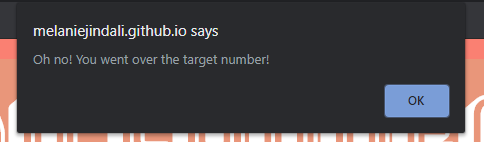

# The Crystal Collector Game

## Overview
The Crystal Collector Game is a game where you will have to match the given number at the start of the game. There are 4 crystals, each with a mysterious value behind them. Only when you click a crystal, the value of it will be added onto your current score. When you match the target number, an alert will pop up stating "We have a winner!" and it will increase the point for the wins. When you go over the target score, another alert will pop up stating "Oh no! You went over the target number!" and it will increase the point for the losses. After each round, a new target score is given and the value of the crystals changes.

### Beforehand...
Read the directions of the game before starting.

### To start the game...
Try to match the target number by clicking on any crystal. Be sure to pay attention to the value of each crystal!

### Results!
When you win...

When you lose...

### Built with:
* HTML/CSS
* JavaScript
* jQuery

Play the game [here](https://melaniejindali.github.io/Crystal-Collector/)!
